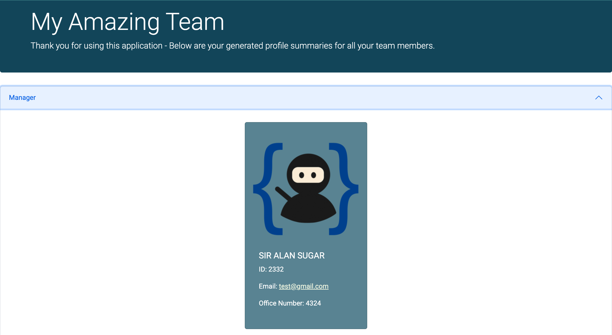
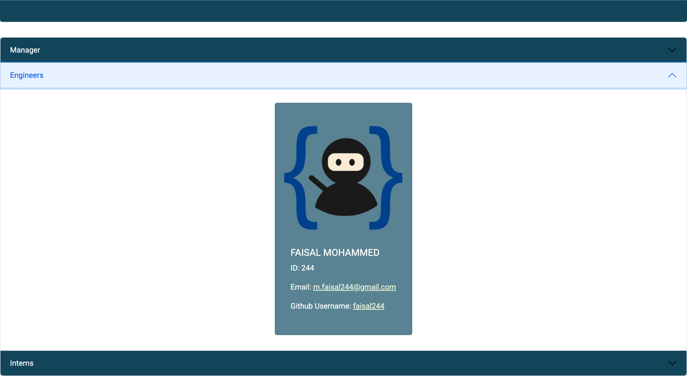
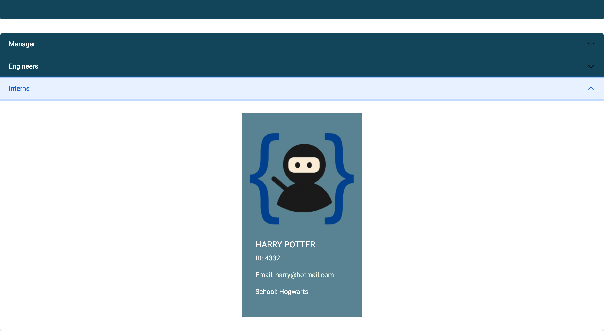
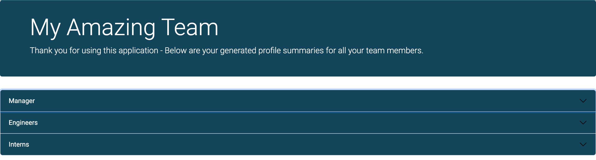
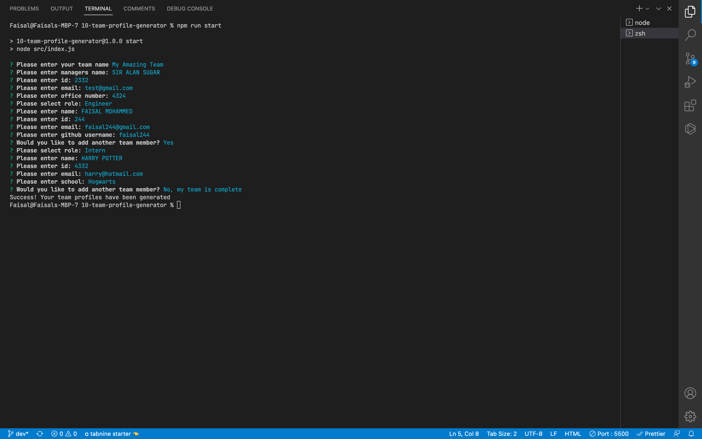
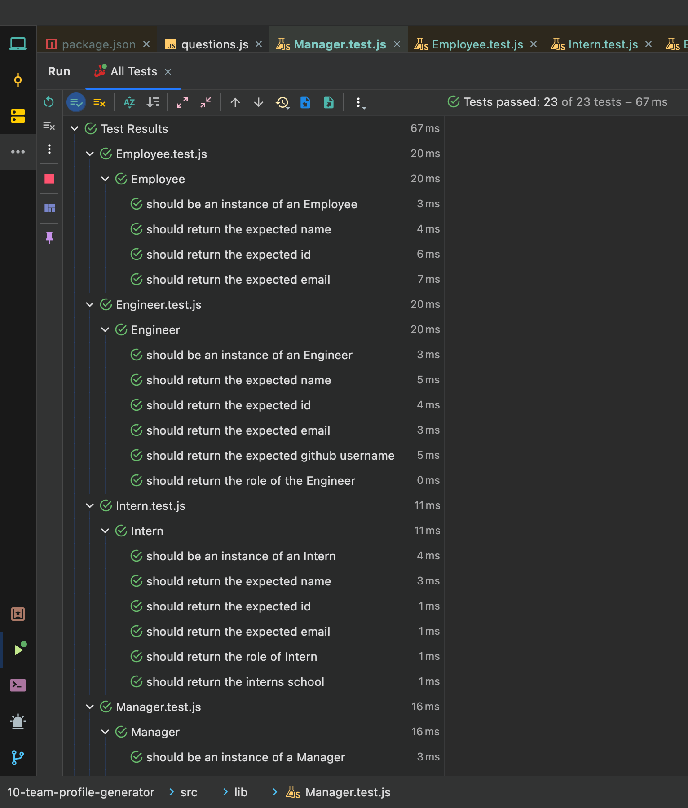
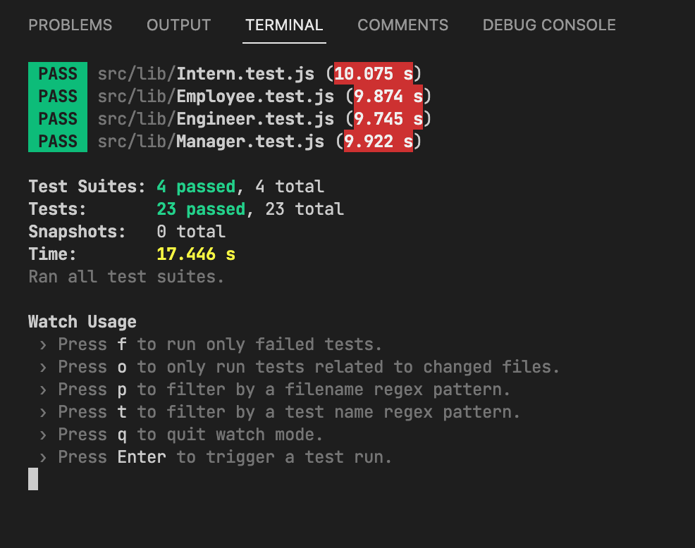

# Object-Oriented Programming: Team Profile Generator

## Table of Contents

- [Description](#description)
- [User Story](#user-story)
- [Acceptance Criteria](#acceptance-criteria)
- [Installation](#installation)
- [Usage](#usage)
- [Video Demo](#video-demo)
- [Screenshots](#screenshots)
- [Contact Me](#contact-me)
- [My Development Environment](#my-development-environment)
- [Languages and Packages used](#languages-and-packages-used)

## Description

During my time at the University of Birmingham Full Stack Web Development Bootcamp, I was tasked with building a Node.js command-line application that takes in information about employees on a software engineering team, then generates a HTML webpage that displays summaries for each team member. This application uses Jest for running the unit tests and Inquirer for collecting input from the user.

A wise Software Engineer once told me that it is my responsibility as a developer that for every line of code i write, there must be a corresponding test. Testing is key to making code maintainable long-term, so i also also wrote unit tests for my code using the Jest.js framework and ensured that it passed each test.

## User Story

```md
AS A manager
I WANT to generate a webpage that displays my team's basic info
SO THAT I have quick access to their emails and GitHub profiles
```

## Acceptance Criteria

```md
GIVEN a command-line application that accepts user input
WHEN I am prompted for my team members and their information
THEN an HTML file is generated that displays a nicely formatted team roster based on user input
WHEN I click on an email address in the HTML
THEN my default email program opens and populates the TO field of the email with the address
WHEN I click on the GitHub username
THEN that GitHub profile opens in a new tab
WHEN I start the application
THEN I am prompted to enter the team manager’s name, employee ID, email address, and office number
WHEN I enter the team manager’s name, employee ID, email address, and office number
THEN I am presented with a menu with the option to add an engineer or an intern or to finish building my team
WHEN I select the engineer option
THEN I am prompted to enter the engineer’s name, ID, email, and GitHub username, and I am taken back to the menu
WHEN I select the intern option
THEN I am prompted to enter the intern’s name, ID, email, and school, and I am taken back to the menu
WHEN I decide to finish building my team
THEN I exit the application, and the HTML is generated
```

## Installation

The application will be invoked by using the following command into your terminal / CLI

```

git clone git@github.com:faisal244/team-profile-generator.git
cd team-profile-generator
npm install

```

## Usage

Once installed, please execute the following command in your terminal to run this application:

```

npm run start

```

## Video Demo

A walkthrough video of the application can be viewed by [clicking here](https://drive.google.com/file/d/1cC2Kk9u7vsTqa8HeVQG_YcqPzZlT3jUG/view?usp=sharing)

## Screenshots

The following images show the application passing all tests within the Jest testing framework (both in terminal and in the Jest testing and debugging suite within Webstorm), as well as the user journey in the CLI and the generated HTML file’s appearance and functionality:









## Contact me

- Contact me by Email: [m.faisal244@gmail.com](mailto:m.faisal244@gmail.com)

- [Connect with me on linkedin](https://www.linkedin.com/in/faisal244/)

- [View my Portfolio](https://faisal244.github.io/Portfolio/)

## My Development Environment

- VScode
- Terminal
- Webstorm
- MacOS Monterey
- Git
- Github

## Languages and Packages used

- Javascript
- Jest
- Node.JS
- Inquirer Package
- Bootstrap 5.2
- jQuery
- Google Fonts

---

---
